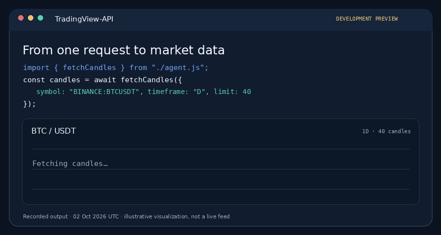

# TradingView-API

**Build with market data, from your first chart to a running watcher.** Fetch candles and quotes, run indicators and strategies, and turn ideas into working tools. An independent community project, not an official TradingView API.

[Get started](#get-started) · [Explore examples](examples) · [Read the data API guide](docs/data-api.md)

**Language:** English · [Français](docs/README.fr.md) · [Español](docs/README.es.md) · [Português](docs/README.pt.md)

[](https://github.com/Mathieu2301/TradingView-API/actions/workflows/tests.yml) [](https://www.npmjs.com/package/@mathieuc/tradingview) [](https://github.com/Mathieu2301/TradingView-API)



*An actual candle request, recorded on 2 October 2026 with the development preview (`fetchCandles`, called `getCandles` in version 4) and visualized for this demo. Prices are not live.*

### One request, real data

> **V4 beta is currently available from this repository, not from npm.** Build the source as shown below before running this example. The latest npm release is still v3 and does not export `getCandles`.

```js
import { getCandles } from '@mathieuc/tradingview/data';

const candles = await getCandles({ symbol: 'BINANCE:BTCUSDT', timeframe: 'D', count: 40 });
console.log(candles.at(-1)); // { time, open, high, low, close, volume }
```

Prefer to start without code? The setup paths below work too.

> **Version 4 is a breaking rewrite** in TypeScript, with a new API and no compatibility layer. Coming from v3? Read the [migration guide](docs/migration-v4.md). Every v3 feature is still available: see the [coverage matrix](docs/v4-coverage.md). npm versions 3.x keep the previous `Client` API; check the [npm page](https://www.npmjs.com/package/@mathieuc/tradingview) for the version you install.

## Get started

### 1. Molted.cloud — recommended, no local setup

[Create an agent on Molted.cloud](https://molted.cloud/) and share this repository with it. Describe what you want to build; the agent can read the docs, set up a workspace, and help you get from an idea to a working project. For example, ask it to build a market-data watcher with this library. [See an example on Molted Studio](https://molted.studio/dreams/market-watch-alerts).

### 2. Claude Code, Codex, or another coding assistant

Open your project in your preferred coding assistant and give it the [repository link](https://github.com/Mathieu2301/TradingView-API). You can start with:

> Read the TradingView-API README and the data API guide. Build the V4 beta from source, make a small example that fetches candles and watches a quote, and show me how to run it.

The assistant can handle the setup, but you keep the project in your own environment.

### 3. Install manually

The V4 beta requires Node.js 20 or later, or Bun. **Until the V4 npm release, install it from source:**

```bash
git clone https://github.com/Mathieu2301/TradingView-API.git
cd TradingView-API
npm ci && npm run build
node examples/candles.js
# Or use Bun: bun install && bun run build && bun examples/candles.js
```

Inside this built checkout, the examples and package self-imports use the V4 API. Running `npm install @mathieuc/tradingview` or `bun add @mathieuc/tradingview` in another project currently installs **v3**, which has the old `Client` API. Do not copy the V4 imports into a project that has v3 installed.

The V4 package is ESM with TypeScript declarations. CommonJS projects can `require()` it on Node 20.19+ or 22.12+, or use `await import()`.

### Want to contribute?

[Open an issue](https://github.com/Mathieu2301/TradingView-API/issues/new/choose) to discuss a feature or report a bug, or send a pull request. Questions and early ideas are welcome; you do not need a perfect reproduction to start a conversation. `npm run check` runs the type check, lint, tests, build and package smoke test.

## Data API

The data API handles connections, sessions, timeouts and cleanup for you. It suits any application: scripts, servers, dashboards, bots or agents.

```ts
import {
  getCandles, watchCandles, getQuote, getIndicatorData, searchMarkets,
} from '@mathieuc/tradingview/data';

// One-shot: resolves with complete data, then releases everything.
const hourly = await getCandles({ symbol: 'BINANCE:BTCUSDT', timeframe: '60', count: 500 });
const lastWeek = await getCandles({ symbol: 'NASDAQ:AAPL', timeframe: '15', from: new Date(Date.now() - 7 * 86_400_000) });
const quote = await getQuote('BINANCE:BTCUSDT');
const [market] = await searchMarkets('ethereum', { type: 'crypto' });

// Watcher: keeps streaming until stopped.
const watcher = await watchCandles({ symbol: 'BINANCE:BTCUSDT', timeframe: '1' }, {
  onData: (candles) => console.log(candles.at(-1)?.close),
  onError: (error) => console.error(error.code, error.message),
});
await watcher.stop();

// Indicators and strategies (Pine scripts need an account).
const { values } = await getIndicatorData({
  symbol: 'BINANCE:BTCUSDT', indicator: 'STD;RSI', credentials: { session, signature },
});
```

| Need | Function |
| --- | --- |
| Candles: latest bars, deep history, date ranges, Heikin Ashi/Renko/... | `getCandles`, `watchCandles` |
| Quotes: last price, change, bid/ask, volume... | `getQuote`, `getQuotes`, `watchQuotes` |
| Indicator values, drawings and strategy reports | `getIndicatorData`, `watchIndicator` |
| Symbol metadata | `getSymbolInfo` |
| Search and ratings | `searchMarkets`, `searchIndicators`, `getTechnicalAnalysis` |

Websocket data functions accept `timeoutMs`, an `AbortSignal`, account `credentials`, and an optional shared `client`. HTTP lookups accept an `AbortSignal` through their options. Errors are `TradingViewError`s with a `code` such as `SYMBOL_ERROR`, `TIMEOUT` or `STUDY_ERROR`. Read the [data API guide](docs/data-api.md) for every option.

## Low-level API

For full control (several charts and studies on one connection, replay mode, raw packets), use the client and sessions directly:

```ts
import { TradingViewClient, getIndicator } from '@mathieuc/tradingview';

const client = new TradingViewClient({ credentials: { session, signature } }); // Credentials are optional
const chart = client.createChart();

chart.on('update', () => console.log(chart.lastCandle?.close));
chart.on('error', (error) => console.error(error.message));
chart.setMarket('BINANCE:BTCUSDT', { timeframe: '60', count: 300 });

const supertrend = chart.createStudy(await getIndicator('STD;Supertrend'));
supertrend.on('update', () => console.log(supertrend.values.at(-1)));

// When your application is finished:
await client.close();
```

The [low-level API reference](docs/low-level-api.md) covers charts, replay, studies, quotes, account and layout functions, Pine permissions, custom transports and protocol helpers. The [examples](examples) show each feature.

## Accounts and limits

Without an account, TradingView serves limited data: shorter intraday history, no Pine studies, and possibly delayed or substitute feeds. With your `sessionid` and `sessionid_sign` cookies (`credentials`), you get what your account can access. Keep them in environment variables or a secret store; never put them in source files, issues or prompts.

## Project links

- [GitHub repository](https://github.com/Mathieu2301/TradingView-API)
- [Trendshift community highlight](https://trendshift.io/repositories/26416)
- [npm package](https://www.npmjs.com/package/@mathieuc/tradingview)
- [Examples](examples)
- [Report a bug or ask for a feature](https://github.com/Mathieu2301/TradingView-API/issues/new/choose)

TradingView is a trademark of its respective owner. This project is not affiliated with or endorsed by TradingView. Check your data provider's terms and applicable market-data permissions for your use case.
